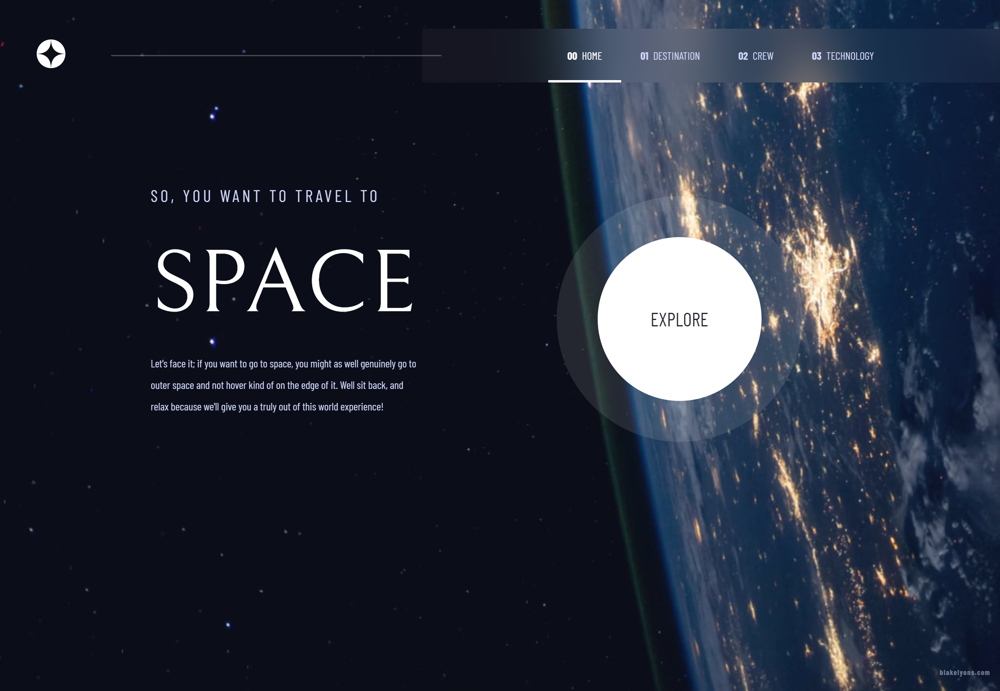

# Frontend Mentor - Space tourism website solution

This is a solution to the [Space tourism website challenge on Frontend Mentor](https://www.frontendmentor.io/challenges/space-tourism-multipage-website-gRWj1URZ3). Frontend Mentor challenges help you improve your coding skills by building realistic projects.

## Table of contents

-   [Overview](#overview)
    -   [The challenge](#the-challenge)
    -   [Screenshot](#screenshot)
    -   [Links](#links)
-   [My process](#my-process)
    -   [Built with](#built-with)
    -   [What I learned](#what-i-learned)
-   [Author](#author)

**Note: Delete this note and update the table of contents based on what sections you keep.**

## Overview

### The challenge

Users should be able to:

-   View the optimal layout for each of the website's pages depending on their device's screen size
-   See hover states for all interactive elements on the page
-   View each page and be able to toggle between the tabs to see new information

### Screenshot

### Links

-   Solution URL: [https://github.com/blakelyons/frontend-mentor-space-tourism-website](https://github.com/blakelyons/frontend-mentor-space-tourism-website)
-   Live Site URL: [https://frontend-mentor-space-tourism-website.pages.dev/](https://frontend-mentor-space-tourism-website.pages.dev/)

## My process

### Built with

-   Semantic HTML5 markup
-   CSS custom properties
-   Flexbox
-   CSS Grid
-   Mobile-first workflow
-   [Vue](https://vuejs.org/guide/introduction.html) - JS library
-   [Vuetify](https://vuetifyjs.com/en/) - Vue Component Framework
-   [mdi/font](https://www.npmjs.com/package/@mdi/font) - Material Design Fonts
-   [Sass](https://sass-lang.com/)

### What I learned

I used this project to try out Vuetify. I learned about the Vuetify Framework, however I mostly just used the Grid layout Component. I wanted to see what the workflow was like while using Vue with Vuetify.

If you want more help with writing markdown, we'd recommend checking out [The Markdown Guide](https://www.markdownguide.org/) to learn more.

## Author

-   Website - [www.blakelyons.com](https://www.blakelyons.com)
-   Frontend Mentor - [@blakelyons](https://www.frontendmentor.io/profile/blakelyons)
-   Twitter - [@blakelyons](https://www.x.com/blakelyons)

**Note: Delete this note and add/remove/edit lines above based on what links you'd like to share.**

## Acknowledgments

This is where you can give a hat tip to anyone who helped you out on this project. Perhaps you worked in a team or got some inspiration from someone else's solution. This is the perfect place to give them some credit.

**Note: Delete this note and edit this section's content as necessary. If you completed this challenge by yourself, feel free to delete this section entirely.**
